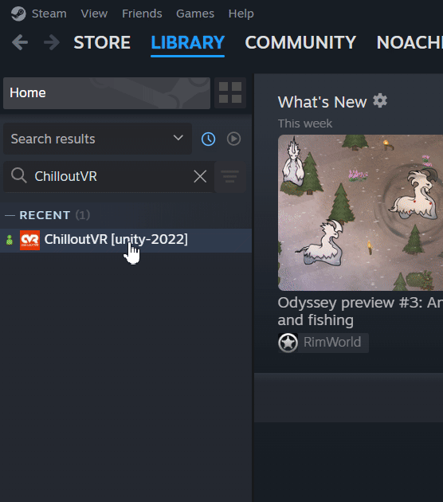

---

# ChilloutVR Issue Tracker
The all new official issue and feature request tracker for ChilloutVR, this includes CCK for now.

## Creating an Issue (Bug Report, Feature Request, ..)

[Create a new Issue](https://github.com/Alpha-Blend-Interactive/ChilloutVR-Issues/issues/new/choose) and choose the correct issue type.

## How to properly Disable Mods

1. Close your game
2. On your Steam Library Right click `ChilloutVR` -> `Browse` -> `Browse Local Files`
3. Rename the `version.dll` to `version.dll.disabled`
4. Now melon loader won't load. To revert it, just remove the `.disabled` from the file name

